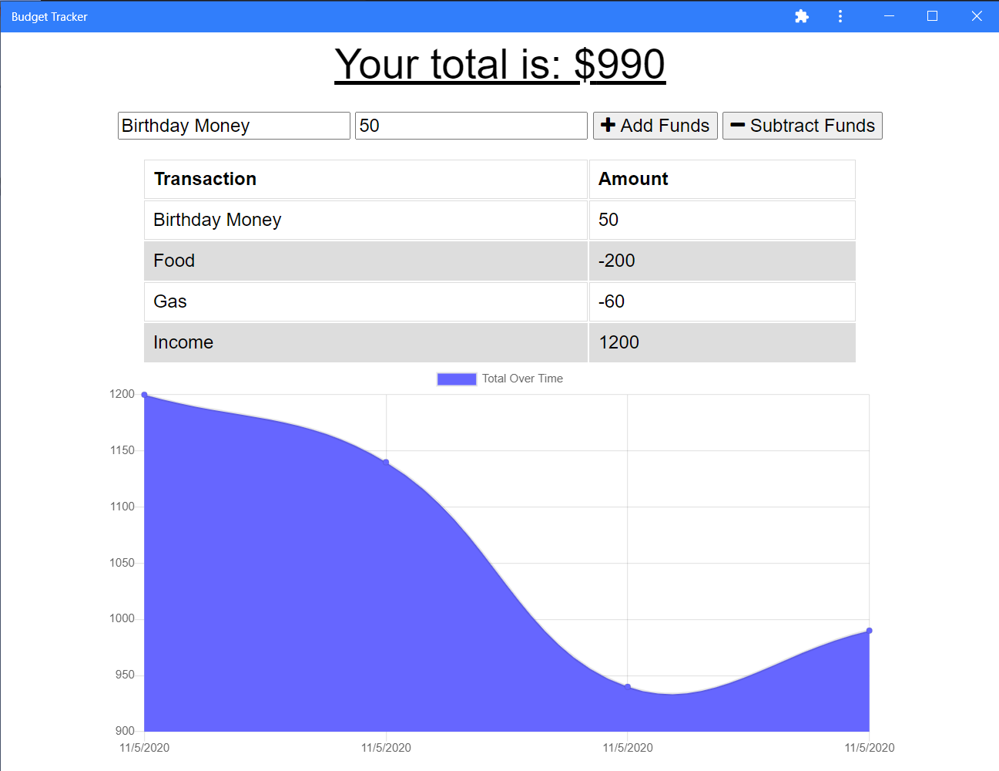

# Budget Tracker

A PWA (Progressive Web App) that lets you track and graph your cash flow over time. May be used offline and will update the online storage after reconnecting.

[Deployed Site: https://mrjcowman-budget-tracker.herokuapp.com/](https://mrjcowman-budget-tracker.herokuapp.com/)

## Table of Contents
1. [Status](#status)
2. [Questions](#questions)

## Status

## Questions
If you have any questions, you can ask Mrjcowman at Mrjcowman@gmail.com or through GitHub at [their profile](https://github.com/Mrjcowman)

